## Architecture

```mermaid
flowchart LR
    start(["__start__"]) --> data_receiver["data_receiver<br/>receives voice"]
    data_receiver -.->|"invalid input"| data_receiver
    data_receiver -.-> check_user["check_user<br/>routes new vs. returning user"]

    check_user -.->|"existing user"| history_loader["history_loader<br/>loads past order history"]
    check_user -.->|"new user"| new_user["new_user<br/>creates a new user record"]
    new_user --> check_user

    history_loader --> check_order_completness["check_order_completness<br/>validates order details"]

    check_order_completness -.->|"complete"| recommendations["recommendations<br/>suggests mood-based dishes"]
    check_order_completness -.->|"incomplete"| complete_info["complete_info<br/>asks for missing details"]
    complete_info --> check_order_completness

    recommendations --> select_item["select_item<br/>user picks a food item"]
    select_item --> order_confirmation["order_confirmation<br/>confirms the final order"]
    order_confirmation -.->|"change item"| select_item
    order_confirmation -.-> update_db["update_db<br/>saves order to database"]
    update_db --> end_(["__end__"])

    classDef pillNode fill:#F1EFE8,stroke:#888780,color:#2C2C2A,rx:20,ry:20
    classDef coreNode fill:#EEEDFE,stroke:#7F77DD,color:#26215C
    classDef branchNode fill:#E1F5EE,stroke:#5DCAA5,color:#04342C

    class start,end_ pillNode
    class data_receiver,check_user,check_order_completness,select_item,order_confirmation,update_db coreNode
    class history_loader,new_user,recommendations,complete_info branchNode
```

# AI-Food-recommendation-agent
AI Mood-Based Food Recommendation Agent — A LangGraph + Gemini + Groq(STT) agent that turns vague voice cravings (e.g., "something spicy, mid-budget") into structured filters, then ranks dishes using simulated order history and retrieval — delivering one confident recommendation instead of generic search results.
