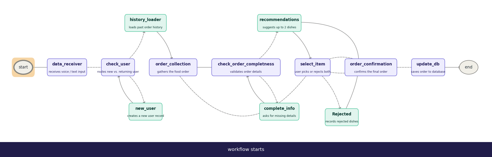

## Architecture

<strong>View interactive architecture diagram</strong>

```mermaid
flowchart LR
    start(["__start__"]):::pillNode --> data_receiver["data_receiver<br/>receives voice / text input"]:::coreNode
    data_receiver -.->|"invalid input"| data_receiver
    data_receiver -.-> check_user["check_user<br/>routes new vs. returning user"]:::coreNode

    check_user -.->|"existing user"| history_loader["history_loader<br/>loads past order history"]:::branchNode
    check_user -.->|"new user"| new_user["new_user<br/>creates a new user record"]:::branchNode
    new_user --> check_user

    history_loader --> order_collection["order_collection<br/>gathers the food order"]:::coreNode
    order_collection --> check_order_completness["check_order_completness<br/>validates order details"]:::coreNode

    check_order_completness -.->|"complete"| recommendations["recommendations<br/>suggests mood-based dishes"]:::branchNode
    check_order_completness -.->|"incomplete"| complete_info["complete_info<br/>asks for missing details"]:::branchNode
    complete_info --> check_order_completness

    recommendations --> select_item["select_item<br/>user picks a food item"]:::coreNode
    select_item --> order_confirmation["order_confirmation<br/>confirms the final order"]:::coreNode
    order_confirmation -.->|"change item"| select_item
    order_confirmation -.-> update_db["update_db<br/>saves order to database"]:::coreNode
    update_db --> end_(["__end__"]):::pillNode

    classDef pillNode fill:#F1EFE8,stroke:#888780,color:#2C2C2A
    classDef coreNode fill:#EEEDFE,stroke:#7F77DD,color:#26215C
    classDef branchNode fill:#E1F5EE,stroke:#5DCAA5,color:#04342C
```

Static PNG exports of the graph are also available in [`Graph/`](Graph/).